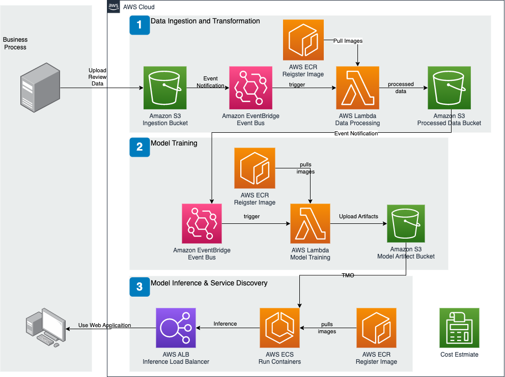
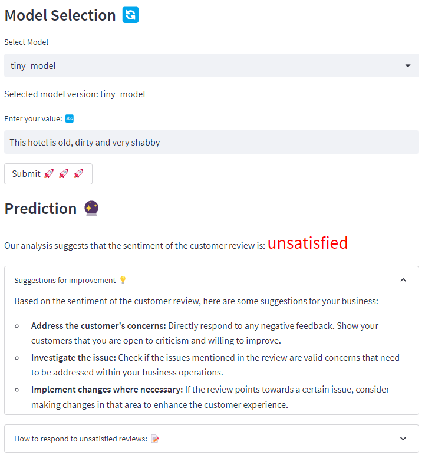

# Hotel Review Sentiment Analysis
**Reviews are vital for the hotel industry**, influencing potential customers and shaping a hotel's reputation. However, manually analyzing reviews is time-consuming due to the increasing volume of online feedback. To streamline this process, sentiment analysis and NLP techniques can automate the analysis of reviews, allowing businesses to efficiently extract insights and prioritize customer needs, leading to improved guest experiences.

In this project, we explore the possiblity of end-to-end machine learning solutions on AWS Cloud. Our goal is to build a light-weight pipeline that can be tuned and run with zero-to-none cloud overhead. For demonstration, we use [Trip Advisor Hotel Reviews](https://www.kaggle.com/datasets/andrewmvd/trip-advisor-hotel-reviews). 


## AWS Setup
To read from or write to S3, an user **has to** set up his/her environments. This guide assumes you have installed the aws CLI and will use aws profile as the preferred way to log in. If you have not yet configured an aws profile, do so with the following:
```shell
aws configure sso --profile personal-sso-admin
```

You may name the profile whatever you like so long as it helps you identify the Account/Role being used. In this guide, we will use `personal-sso-admin`.

If you have already done this, you may need to login to refresh credentials and verify identity using `sts`.
```shell
aws sso login --profile personal-sso-admin
aws sts get-caller-identity --profile personal-sso-admin
```

## Cloud Pipeline

At the high level, the pipeline can be broken down into two parts - **model training** and **model inference**. In model training, when a client drops a file as the designated S3 bucket, the pipeline is designed to automatically pre-process the data, train the model and save it to another s3 bucket. The model inference pipeline would then pick up these models, and display it on the website so that guest representative can check for it real-time.

At a lower level, the implementation can be divided into three parts: 
### Data Ingestion and Transformation
We first create an S3 bucket in the AWS Management Console to hold the raw data and another S3 bucket ready for processed data. To list the S3 buckets in your account: 
```shell
aws s3 ls
```

We are using the EventBridge notifications - as of now, this is the new/preferred way. You can read more about it in the [AWS EventBridge User Guide](https://docs.aws.amazon.com/eventbridge/latest/userguide/eb-what-is.html). Remember to enable Amazon EventBridge notifications and **Save changes**


We then started a virutal environment to code out the related modules - that ensures we have the minimal image.
```shell
python -m venv .venv
source .venv/bin/activate
```
Beware of where you save the files. From the AWS Lambda FAQ
> Each Lambda function receives 500MB of non-persistent disk space in its own /tmp directory.

When we are done, we saved the packages installed in the virtual environment using `pip freeze > requirements.txt`. As default, AWS Lambda requires a function handler. A function handler can be any name; however, the default name in the Lambda console is `{lambda_function}.{lambda_handler}`. As a convention, for all our code, we use `main.lambda_handler` as the entrypoint. We then build the docker image, tag it and push it to a ECR private repo: 
```shell
# using AWS CLI
# retrieve an authentication token and authenticate your Docker client to your registry
aws ecr get-login-password --region $region | docker login --username AWS --password-stdin $aws_account_id.dkr.ecr.$region.amazonaws.com
# build your Docker image using the following command
docker build -t $image_name .
# tag your image - default to "latest"
docker tag $image_name:latest $aws_account_id.dkr.ecr.$region.amazonaws.com/$image_name:$tag
# push the image
docker push $aws_account_id.dkr.ecr.$region.amazonaws.com/$image_name:$tag
```

The image can now be found at the repositry - for security, we are using a container image from a *private* repositories on ECR. Now, we head back tot the Lambda console to create the Lambda function, with the EventBridge as a trigger.


We can also generate a test - the following test is a boiler plate code with the bucket name changed to minic a `ObjectCreated` event on our raw data bucket: 
```json
{
  "Records": [
    {
      "eventVersion": "2.0",
      "eventSource": "aws:s3",
      "awsRegion": "us-east-2",
      "eventTime": "1970-01-01T00:00:00.000Z",
      "eventName": "ObjectCreated:Put",
      "userIdentity": {
        "principalId": "EXAMPLE"
      },
      "requestParameters": {
        "sourceIPAddress": "127.0.0.1"
      },
      "responseElements": {
        "x-amz-request-id": "EXAMPLE123456789",
        "x-amz-id-2": "EXAMPLE123/5678abcdefghijklambdaisawesome/mnopqrstuvwxyzABCDEFGH"
      },
      "s3": {
        "s3SchemaVersion": "1.0",
        "configurationId": "testConfigRule",
        "bucket": {
          "name": "msia423-group8-raw",
          "ownerIdentity": {
            "principalId": "EXAMPLE"
          },
          "arn": "arn:aws:s3:::msia423-group8-raw"
        },
        "object": {
          "key": "test%2Fkey",
          "size": 1024,
          "eTag": "0123456789abcdef0123456789abcdef",
          "sequencer": "0A1B2C3D4E5F678901"
        }
      }
    }
  ]
}
```
Another remark: when building the modules, we converted the config file into a dictionary in `main.py` allowing environemnt variable overrride, e.g.,: 
`config['data_processing']['satisfied_threshold'] = os.getenv('SATISFIED_THRESHOLD', 3)`
This allows us to update environment variables directly in the Lambda console without touching/pushing the underlying image: 


### Model Training
Now that we have the processed data, we conduct the following steps: 
1. **Acquire clean data**: the original review is a scale of 1-5 and for simplicity, we convert them to **satisfied vs. unsatisfied**. We believe that business wants to focus on the unsatisfied (1 and 2) customers
2. **Train/Test split**: the reviews are imbalanced, so we use stratified sampling - this needs to happen before the feature engineering step to avoid data leakage
3. **Feature Engineering**: we conducted TF-IDF (term frequency-inverse document frequency), a common technique that can quantify the importance or relevance of string representations. This allow us to represent these words as vectors
4. **Modeling Tunning**: we tried two models - Logistic Regression classifier and Naive Bayes classifier (both from `scikit-learn` package). After conducting grid search for hyperparameters on each, we save the best model based on score, and save it to our artifact bucket on S3
5. **Evaluate Performance**: we then evalute the models (currently listed in the config file are AUC, confusion matrix, accuracy and classification report)
6. **Model Deployment**: finally, we retrain the best model on the full dataset and save the result (both vector representations and TMO) to the s3 bucket, which would be consumed by our front-end

Most of the AWS configurations for model building and training follows those of data collection. Here, we are adding the feature that allows users to see different versions of models (e.g., below you would see **default vs. tiny_model**). This can be easily triggered by updating `$AW_PREFIX`. The idea is to allow end-user to compare models trained on different data. As of now, we are only looking at the hotel industry, but this can be easily modified to meet the needs of any retail/service industry. When the user upload the raw data, the pipeline runs end-to-end automatically.


### Model Inference and Service Discovery
The model inference pipeline is a replica of what is covered in [Streamlit lab](https://github.com/MSIA/423-streamlit-lab-activity), and after connecting to the Northwestern VPN, you can find the website [here](http://group8-inference-load-balancer-2091079623.us-east-2.elb.amazonaws.com/).

It allows user to pick the model version (same as listed on the S3 bucket for model artifacts). The user can interact it by entering the prompt, and the model will make a prediction: 


If model deemed the review is "unsatisfied", it will also provide some suggestions: 


Some potential next steps: 
- increase model accuracy and flexibility
- add generative-AI API call to the suggestions

## Local Runtime

	├── ...
		├── README.md
		├── LICENSE
	notebooks/
		├── model-v2.ipynb
		├── model.ipynb
		├── Cloud_EDA.ipynb
	config/
		├── default-config.yaml
		├── logging_local.conf
		├── local.conf
		├── data-config.yaml
		├── model-config.yaml
	data/
		├── raw/
			├── hotel_reviews_1000.csv
	models/
		├── default/
			├── vectorizer.pkl # load data as vectore
			├── inference_model.pkl # load TMO
	src/
		├── __init__.py
		├── pre-processing/
			├── data_processing.py
			├── acquire_data.py
			├── __init__.py
			├── requirements.txt
			├── Dockerfile
			├── main.py
		├── modeling/
			├── test_logger.py
			├── tune_model.py
			├── extract_clean_data.py
			├── upload_artifacts.py
			├── train_model.py
			├── __init__.py
			├── score_model.py
			├── requirements.txt
			├── Dockerfile
			├── evaluate_model.py
			├── main.py
		├── inference/
			├── requirements.txt
			├── app.py
			├── Dockerfile
			├── aws_utils.py

The code is structured so that each section can be run locally. For example, to run the data pre-processing portion, one can do the following: 
```shell
python -m venv .venv
cd src/pre-processing
python -m pip install --upgrade pip
pip install -r requirements.txt
python __init__.py
```

The configuration files are in the `config` folder, where you will also find the logger config file. Data visualzation can be found at `notebook/Cloud_EDA.ipynb`. There are also sample data under the `data/raw` directory and sample model artifacts under `models` directory. Note that the docker image only exists for data preparation and model training and are only intended for Linux.

# Team Members
- Hong, Brian
- Li, Zhengyuan (Donald)
- Xu, Yiyue (Jessie)
- Zhang, Wencheng (Bill)
